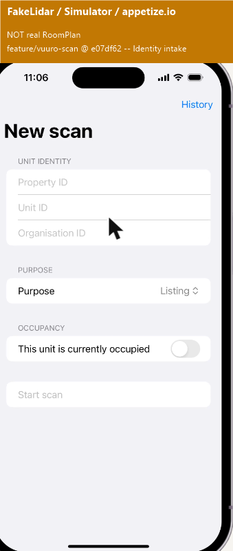
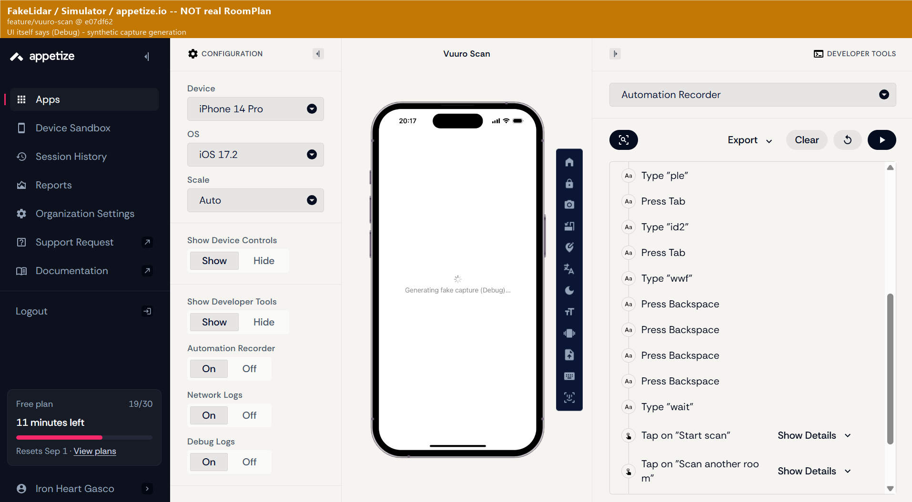
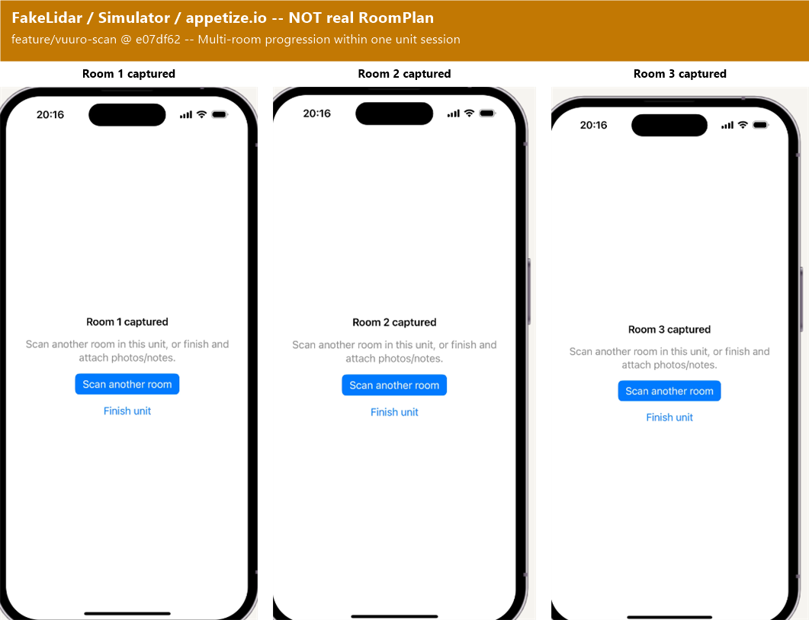
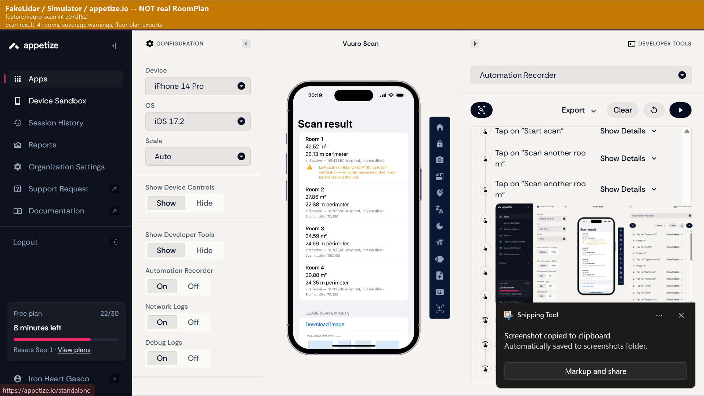
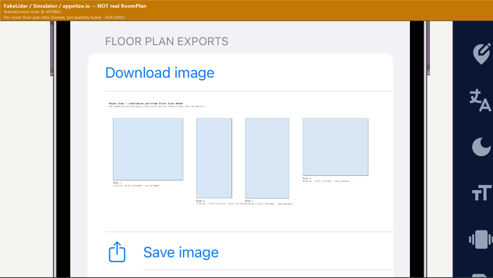
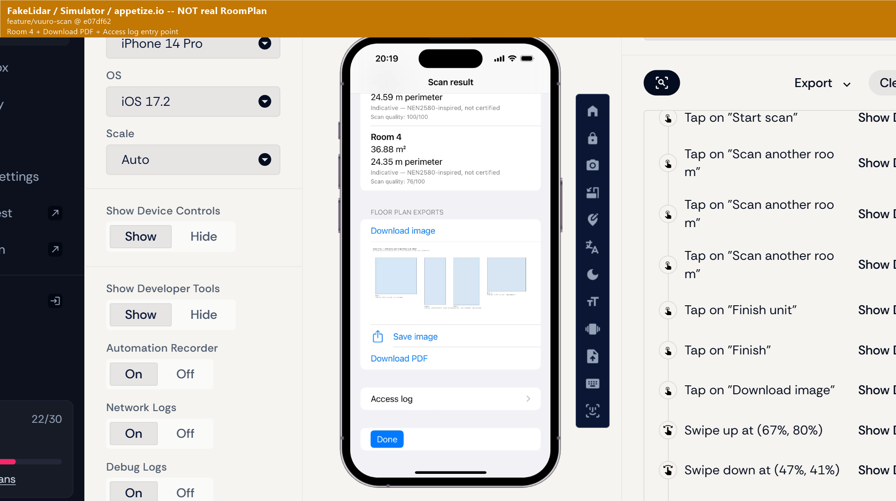

# Vuuro Scan — Engineering Walkthrough

**Branch:** `feature/vuuro-scan` (this walkthrough itself lives on `docs/vuuro-scan-walkthrough`, branched from it)
**As of commit:** `640cf67`
**Author:** Joven
**Date:** 2026-09-01

This is the fuller version of the two questions Mark asked for a short Slack answer
to: status against the 6 Aug brief in three buckets, and what we need from him. It's
written for whoever opens this repo next, not just Mark — assume no prior context
beyond the brief itself (`docs/VUURO_SCAN_LIDAR_DIRECTION_BRIEF_JOVEN_2026-08-06.pdf`).

---

## 1. Why a standalone Scan Service, not inside the rental app

The brief's opening line is "own property reality capture for Vuuro" — a branded
scanning product *beside* the rental platform, joined to it later over an API, not a
feature bolted onto the rental app's existing codebase. Three reasons that shaped this
as a standalone service from day one:

- **Provider neutrality.** RoomPlan is one capture provider. The brief never assumes
  it's the only one — Android, a third-party SDK, or a future in-house capture method
  should all be adapters behind the same contract, not special-cased into the rental
  app's own data model. A standalone service with one adapter boundary
  (`RoomPlanSimulatorAdapter`) makes that swap a storage/adapter-layer change, not a
  rewrite (`docs/adr/0001-scan-service-stack.md`).
- **Independent release and proof cadence.** The rental app has its own release
  cycle, its own stability bar, and (eventually) its own on-call. A capture pipeline
  that's still being proven against real LiDAR hardware for the first time has no
  business sharing a deploy with it.
- **The brief's hard constraint — "you own the net under it."** An independent,
  from-scratch verification suite that never imports the code it's checking is much
  easier to build and reason about against one small service with one clear contract
  boundary than against a feature woven into a much larger existing app.

## 2. The shape of the system

Four pieces, one shared contract:

| Piece | What it is | Where |
|---|---|---|
| **Scan Service** | The only backend. Plain PHP 8.1+, PDO/SQLite, no framework, no Composer. One hand-rolled router (`public/index.php`) matching method+path per route. | `scan-service/` |
| **iOS capture client** | SwiftUI app: identity/consent intake → guided RoomPlan capture → optional photos/notes → results/export. | `ios-app/` |
| **`ios-app-with-design/`** | An optional Vuuro-branded restyle of the same app, kept deliberately separate so it can never affect `ios-app/`'s own state. Not in CI. Promotion decision still open (see §8). | `ios-app-with-design/` |
| **FloorPlan contract** | The one vendor-neutral JSON shape every capture adapter converts into and every consumer reads from. Designed API-first, before any real consumer existed. | `contracts/floorplan.schema.json` |

Plus two things that exist specifically to keep the above honest:

- **The independent net** (`scan-service/net/verify_*.php`) — HTTP-only scripts that
  re-derive expected results from scratch and never import `src/`. This is the actual
  merge gate, not the unit tests. As of today it runs as **`.gitlab-ci.yml`'s
  `scan-service-net` job on a self-hosted GitLab Runner** (see §5 for why self-hosted).
- **`scan-service/net/verify_*.php`'s sibling, `scan-service-docker-build`** — a
  second CI job added today that runs a real `docker build` + `docker run` +
  `/health` check against `scan-service/Dockerfile` on every push. Added because the
  Dockerfile silently didn't build for weeks (see §5) and nothing in CI would have
  caught it.

## 3. How a capture actually moves

```
Identity/consent intake (ios-app)
  -> DeviceCapability.isRoomPlanSupported gate
  -> RoomCaptureCoordinator (guided RoomPlan session, or FakeLidarMode's synthetic
     data in DEBUG builds when no real LiDAR is reachable)
  -> CapturedRoomExporter turns the capture into RoomPlan-shaped JSON
  -> ScanServiceClient POSTs it to the Scan Service:
       POST /scan-sessions                      (once, at session start)
       POST /scan-sessions/{id}/capture          (once per room)
       POST /scan-sessions/{id}/photos           (optional, real image bytes via
       POST /scan-sessions/{id}/photo-uploads     a separate multipart upload first)
       POST /scan-sessions/{id}/notes            (optional)
  -> RoomPlanSimulatorAdapter validates the raw capture and converts it into the
     FloorPlan contract (shoelace-formula area/perimeter, coverage/confidence scoring)
  -> ScanSessionRepository persists it (SQLite, one row per session, BEGIN IMMEDIATE
     write-lock so two concurrent writers to the same session can't silently clobber
     each other)
  -> GET /scan-sessions/{id}/export/floorplan.png|pdf renders the stored FloorPlan
     into a per-room export (FloorPlanImageRenderer / FloorPlanPdfRenderer)
```

Every route after session creation requires `X-Scan-Access-Token`, checked with
`hash_equals()`. Rate limiting, idempotent-retry handling (`Idempotency-Key`), and a
request-body-size cap all sit ahead of the route logic itself — see
`scan-service/README.md`'s "Known limits" for the exact budgets.

## 4. How it looks and works

All screenshots below are from **`feature/vuuro-scan` @ `e07df62`**, captured
2026-09-01 via **appetize.io's cloud iOS Simulator** (iPhone 14 Pro, iOS 17.2) with
**`FakeLidarMode`** supplying synthetic capture data — **not a real RoomPlan / real
LiDAR capture**. That gap is the single biggest thing this walkthrough can't close;
Mark's real-device test (`ios-app/README.md`'s checklist, iPhone Pro + Mac + Xcode) is
what closes it, and is expected shortly.

Each image is labeled the same way Mark asked for: which capture path it is, plus
branch and commit.

### 4.1 Identity / consent intake



### 4.2 Generating a capture — the UI itself says "(Debug)"



### 4.3 Multi-room progression within one unit session



### 4.4 Scan result



### 4.5 Floor plan exports



### 4.6 Access log entry point



### 4.7 The part a screenshot alone can't prove: the server round-trip

A screenshot only proves the UI rendered something. The actual network capture
(exported as a `.har` file from appetize.io's Network Logs, available on request)
shows this session's real requests all hitting the real Scan Service, through a
`localtunnel` tunnel from the cloud simulator to the developer machine:

```
POST https://<tunnel>/scan-sessions                          -> HTTP 201
POST https://<tunnel>/scan-sessions/{id}/capture              -> HTTP 200  (x3)
GET  https://<tunnel>/scan-sessions/{id}/export/floorplan.png -> HTTP 200
```

The capture response body is the real `RoomPlanSimulatorAdapter` output, not a mock:

```json
{
  "measurement_basis": "indicative_nen2580_inspired",
  "rooms": [{
    "floor_area_m2": 28.62,
    "perimeter_m": 22.89,
    "confidence": "low",
    "coverage": {
      "score": 36,
      "usable": false,
      "message": "Low scan confidence (36/100) across 5 surface(s) — consider rescanning this room before leaving the unit."
    }
  }]
}
```

## 5. Choices made where the brief was open, and why

The brief is deliberately silent on implementation details in a lot of places. The
notable calls made, and the reasoning:

- **Plain PHP, no framework, no Composer** (`docs/adr/0001`). Zero dependency risk,
  and the brief's actual hard constraint is the independent net, not a particular
  backend technology.
- **Per-room floor plan tiles, not a spatially fused building layout**
  (`docs/adr/0002`). Separate RoomPlan sessions have no shared coordinate frame;
  fusing them would fabricate room adjacency that was never actually captured. Fixing
  this needs the capture flow itself to move to one continuous multi-room session,
  which hasn't happened yet.
- **Per-session capability token, not a login system** (`docs/adr/0003`). Designed to
  compose underneath a future Vuuro account system, not replace it. Deliberately
  doesn't solve tenant isolation beyond token possession, or TLS — both are real
  deployment gaps, documented as such, not silently assumed away.
- **Laser-pairing spike deferred** (`docs/adr/0004`). Optional in the brief; nothing
  else in the build needs it; no pilot has asked for ground-truth validation yet.
- **RoomPlan-shaped JSON fixtures, not a real capture, for the FIRST movement**
  (`docs/adr/0001`). Forced by zero Mac/Xcode/LiDAR access on the dev machine for most
  of this build — a machine constraint, not something the brief signed off on. The
  gap it leaves is exactly what Mark's device test now closes.
- **Self-hosted GitLab Runner instead of GitLab's shared runners** (new today, not yet
  its own ADR). The shared-runner tier ran out of CI/CD minutes and a pipeline that
  never runs is not a gate — see §6. Registered a project runner on the developer's
  Windows machine (tag `windows-shell`), using Docker-in-WSL2 for the one job that
  needs a real Docker build. No GitLab CI/CD minutes are spent by this project's
  pipelines anymore, since it isn't a shared runner.
- **PowerShell, not bash, for that runner's CI scripts.** Git for Windows' bash.exe
  doesn't behave reliably when GitLab Runner launches it detached without a console —
  confirmed live: it silently drops all output and returns exit 0 even for a trivial
  `exit 7`. GitLab's own Windows shell-executor guidance is PowerShell/pwsh, not bash.

## 6. Three buckets: standing vs built-but-not-verified vs parked

**Standing (verified, not just claimed):**

- Scan Service core (sessions, capture ingest, real photo-byte uploads, notes,
  PNG/PDF export, access-log) — 114 unit checks + 270 independent-net checks, run
  fresh today, all green.
- Consent gate, per-session/per-IP rate limiting, idempotent capture retries, request
  body-size cap, and the write-lock concurrency fix — all covered by that same net.
- `scan-service/Dockerfile` actually builds and serves `/health` — verified today via
  a real `docker build` + `docker run` (Docker-in-WSL2), *and* now covered by a
  dedicated CI job (`scan-service-docker-build`) so this can't silently regress again
  the way it just did.
- App Transport Security exception added so a real device can reach a LAN IP over
  plain HTTP (`ios-app/project.yml`).
- `ios-app/`'s `compile-check` (CI, GitHub Actions mirror) — still green.
- End-to-end capture → upload → results → export, **including the multi-room "unit
  story" flow** — proven today via FakeLidarMode + appetize.io + a real server
  round-trip (network capture, not just a screenshot). See §4.

**Implemented, not yet verified:**

- Real RoomPlan capture on real LiDAR hardware. Nothing in this repo has touched a
  real LiDAR sensor yet. This is the single biggest open item, and the next section
  is entirely about it.
- `ios-app-with-design/` — not covered by CI, not appetize-tested.
- Real fused multi-room floor plan layout (see §5's ADR-0002 note).

**Parked (deliberately, with a written reason, not silently dropped):**

- Laser-pairing spike (`docs/adr/0004`).
- TLS and a real Vuuro account-auth system (`docs/adr/0003`).
- Plaintext access-token storage in `ios-app/Sources/History/ScanHistoryStore.swift`'s
  `UserDefaults` — a known, flagged limit, acceptable for this local-pilot window,
  not for a real deployment.

## 7. How close to a Vuuro Scan MVP, and what the next proof is

**Scan Service MVP** — done and independently verified, as of today.

**Vuuro Scan MVP** (one real room, on a capable device, end to end) — not yet. Every
piece needed to get there is now unblocked:

- ATS fixed (§5) — a real device can reach the Scan Service over the LAN.
- `Dockerfile` fixed and verified — Mark can run the Scan Service in Docker on his Mac.
- `ios-app/README.md` has the exact checklist for opening this in Xcode against a
  real device for the first time.

**The next proof is exactly one thing:** one real RoomPlan capture, on a real
LiDAR-capable device, round-tripped through the real Scan Service, following that
checklist. Nothing else in this repo can substitute for it or partially prove it —
that's the whole point of keeping "FakeLidar/simulator" and "real RoomPlan" labeled
separately throughout this document.

## 8. Open questions

- **`ios-app-with-design/` promotion** — keep it as a permanently separate branded
  variant, fold its (purely visual) changes back into `ios-app/`, or retire it? No
  business-logic drift has been found between the two, but no one has diffed them
  since the design variant was last touched.
- **Self-hosted runner, long-term** — is a developer-machine GitLab Runner an
  acceptable permanent answer, or does this project need a paid CI/CD minutes tier or
  a properly hosted runner once more people push to this repo?
- **Real fused multi-room layout** — worth scoping now, or wait until a pilot
  specifically asks for a single spatial floor plan instead of per-room tiles?
- **`docs/status/` and module READMEs going forward** — now that ADRs and module
  READMEs are committed (per Mark's 2026-08-31 request), should the day-to-day status
  notes under `docs/status/` (still local-only) move to the same policy, or stay
  private working notes?
